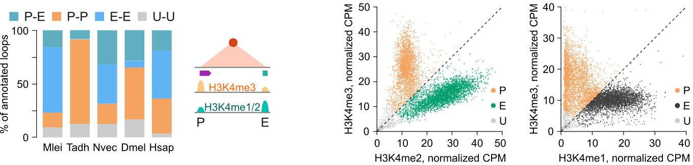

# **Chromatin loop analysis steps**

1. Identify chromatin loops using [SIP](https://github.com/PouletAxel/SIP).
for _Mnemiopsis leidyi_
```
java -Xmx10g -jar SIP_HiC_v1.6.1.jar hic mlei.hic ${CHROMSIZE} ./data/chromatin_loops/SIP juicer_tools_1.13.01.jar \
                                     -norm KR -g 3.0 -min 2.0 -max 2.0 -mat 5000 -d 10 \
                                     -res 400 -sat 0.01 -t 2000 -nbZero 6 -factor 4 -fdr 0.05 -del true -isDroso false \
                                     -cpu $CPU 
```

for _Trichoplax adhaerens_
```
java -Xmx10g -jar SIP_HiC_v1.6.1.jar hic tadh.hic ${CHROMSIZE} ./data/chromatin_loops/SIP juicer_tools_1.13.01.jar \
                                     -norm KR -g 5.0 -min 4.0 -max 4.0 -mat 5000 -d 20 \
                                     -res 100 -sat 0.01 -t 2000 -nbZero 6 -factor 4 -fdr 0.05 -del true -isDroso false \
                                     -cpu ${CPU} 
```

2. Filter loops using APScore to remove regions of genome misassemblies annotated as chromatin loops.
>
>[loop_APScore_filtering.R](loop_APScore_filtering.R)
>

3. Classify loop anchors into promoter and enhancer sites. Here we use Mnemiopsis leidyi as an example.
>
>[loop_anchor_classification.R](loop_anchor_classification.R)
>


4. Annotate genomic bins with a specific motif.
>
>[motif_analysis_in_loop_anchors.R](motif_analysis_in_loop_anchors.R)
>
