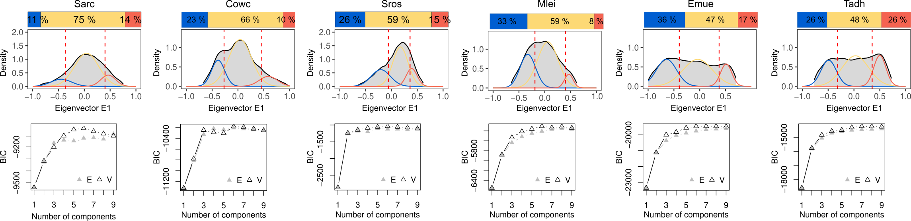

# **Compartmentalization analysis**

To identify compartmentalization profiles, we followed the [cooltools notebook](https://cooltools.readthedocs.io/en/latest/notebooks/compartments_and_saddles.html) workflow.

1. Perform eigen value decomposition on balanced cooler matrices at resolutions equivalent to 5,000, 10,000, 20,000, 40,000 and 50,000 bins per species genome:
>
>[saddle_gc.ipynb](./saddle_gc.ipynb)
>


2. Calculate compartment strength across different resolutions:
>
>[compartment_strength.R](./compartment_strength.R)
>


3. Assign intermediate compartment to regions with weak compartmentalization:
>
>[intermediate_compartment.R](./intermediate_compartment.R)
>


4. Generate A, B and I interval regions.
```
for f in Sarc Cowc Sros Emue Mlei Tadh Nvec Dmel Hsap; do
bedtools groupby -i ${f}_compartment_regions_Gaus_distr.txt -g 1,4 -c 2,3 -o min,max \
| awk -v OFS='\t' '{print $1, $3, $4, $2}' \
> ${f}_compartment_regions_Gaus_distr_region.bed
done
```

5. Calculate the distribution of genomic features, ChIP-seq chromatin signals and RNA-seq expression values across identified compartments:
>
>[omics_in_compartments_gene_and_TEs_densities.R](omics_in_compartments_gene_and_TEs_densities.R)
>
>[omics_in_compartments_input_prep.sh](omics_in_compartments_input_prep.sh)
>
>[omics_in_compartments.R](omics_in_compartments.R)
>
