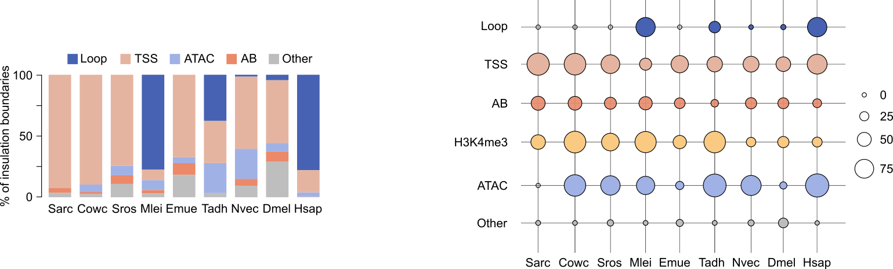

# **Insulation analysis steps**

1. Identify insulation score and insulation boundaries at different resolutions for each species using [cooltools](https://cooltools.readthedocs.io/en/latest/notebooks/insulation_and_boundaries.html):
>
>[cooltools_IS_boundaries.sh](cooltools_IS_boundaries.sh)
>

2. Select the optimal resolution and window sizes for insulation analysis using aggregated metaplots:
>
>[insulation_metaplot.sh](insulation_metaplot.sh)
>
>[insulation_metaplot_ggplot.R](insulation_metaplot_ggplot.R)
>


3. Identify boundary strength and insulation score values for all insulation boundaries (weak and strong) for the selected resolution and sliding windows:

```
cooltools insulation -o "./data/insulation/mlei_1000bpRes.boundaries_w+s.tsv" mlei_mergedRep_200Cload.mcool::/resolutions/1000 5000 10000 --bigwig --min-dist-bad-bin 2
```

4. Plot the distributions of boundary strength values and insulation scores:
>
>[distribution_boundary_strength_and_IS.R](distribution_boundary_strength_and_IS.R)
>


5. Classifications of insulation boundaries:
>
>[boundary_classification.R](boundary_classification.R)
>
